# 🏎️ JetRacer AI — Autonomous Driving System

An end-to-end autonomous driving platform built for the **NVIDIA Jetson Nano** and **Waveshare JetRacer** chassis, combining high-speed track navigation with smart city urban driving compliant with traffic regulations.

---

## 🎯 Core Autonomous Driving Challenges

This repository focuses on solving **two primary autonomous driving benchmarks**:

| 🏁 1. Speed Track Challenge | 🏙️ 2. Smart City Challenge |
| :-: | :-: |
| 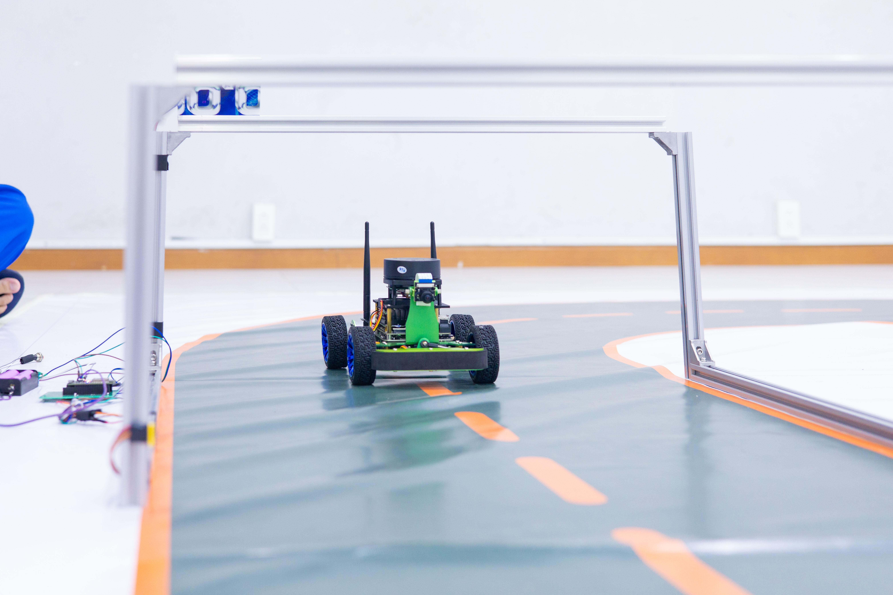 | 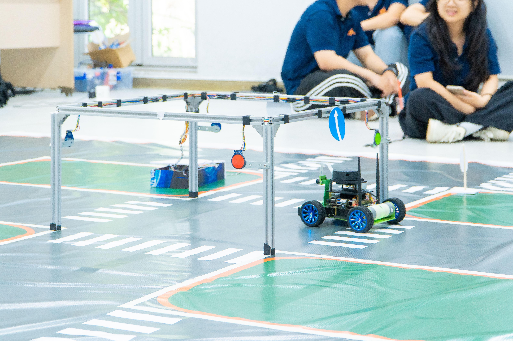 |
| **High-Speed Autonomous Lane Following**<br>Focused on high-speed track navigation, continuous lane boundary detection (ResNet-18 regression), and real-time Stanley steering control. | **Urban Traffic Compliance & Safety**<br>Focused on urban driving compliant with traffic laws, real-time traffic lights & signs (YOLO), intersection rules, and 2-phase obstacle evasion FSM. |

---

## 🎬 Live Autonomous Driving Demo

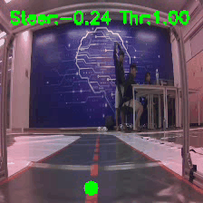

---

## 🏎️ Hardware Platform: Waveshare JetRacer ROS AI Kit

This project is configured and tested for deployment on the **[Waveshare JetRacer ROS AI Kit](https://www.waveshare.com/wiki/JetRacer_ROS_AI_Kit)** — an official high-speed autonomous racing robot platform powered by the **NVIDIA Jetson Nano**.

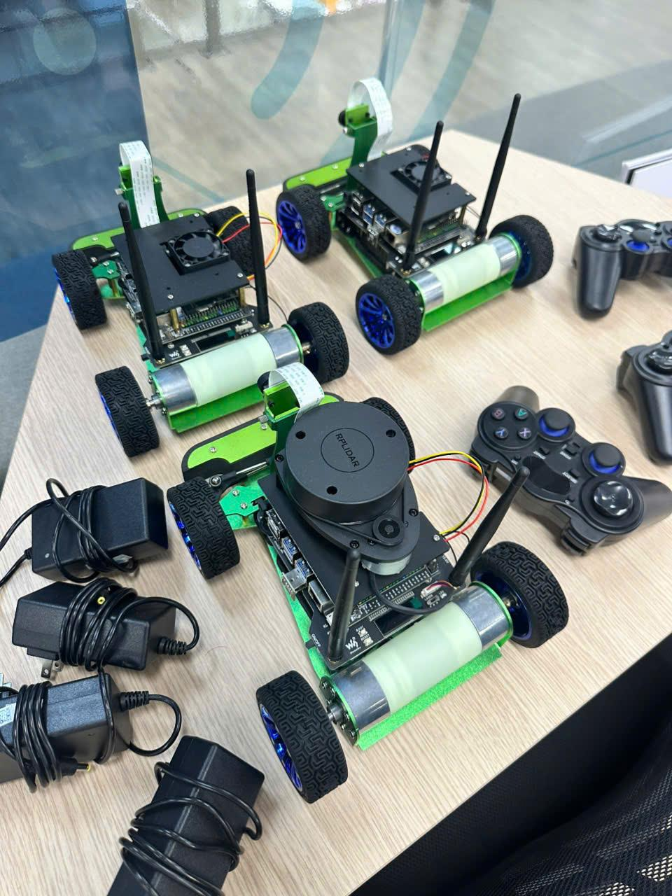

### Key Hardware Specifications:
- **Compute Unit**: NVIDIA Jetson Nano (128-core Maxwell GPU, ARM Cortex-A57 CPU).
- **Steering System**: Ackermann front-wheel steering architecture with high-torque servo motor.
- **Drivetrain**: High-speed DC motor with encoder feedback for precise velocity control.
- **Vision Sensor**: Wide-angle CSI camera module delivering high-frame-rate video input.
- **Middleware & SDK**: ROS Melodic Morenia, PyCUDA, TensorRT FP16 acceleration, and JetRacer HAL.
- **Official Documentation**: [Waveshare JetRacer ROS AI Kit Wiki](https://www.waveshare.com/wiki/JetRacer_ROS_AI_Kit).

---

## 🌟 Visual Model Predictions & Capabilities

### 🛣️ 1. Lane Following & Steering Vector Prediction
ResNet-18 regression model (`02_train_model_onnx.ipynb`) predicting target apex point `(x, y)` from camera frames, converted into steering angles by the **Stanley Controller**.

| Center Line Steering (`-0.06`) | Left Offset Steering (`-0.73`) | Right Offset Steering (`+0.89`) |
| :-: | :-: | :-: |
| 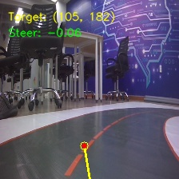 | 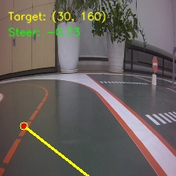 | 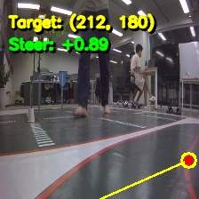 |

---

### 📍 2. Conditioned Trajectory Waypoints Model
Conditioned MobileNetV2 model (`best_trajectory_mobilenet.onnx`) predicting 5 route waypoints `(x, y)` based on high-level navigation commands (**Cmd: TURN LEFT**, **Cmd: STRAIGHT**, **Cmd: TURN RIGHT**).

| Cmd: TURN LEFT | Cmd: STRAIGHT | Cmd: TURN RIGHT |
| :-: | :-: | :-: |
| 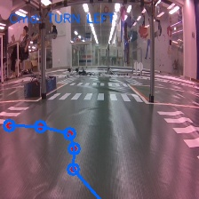 | 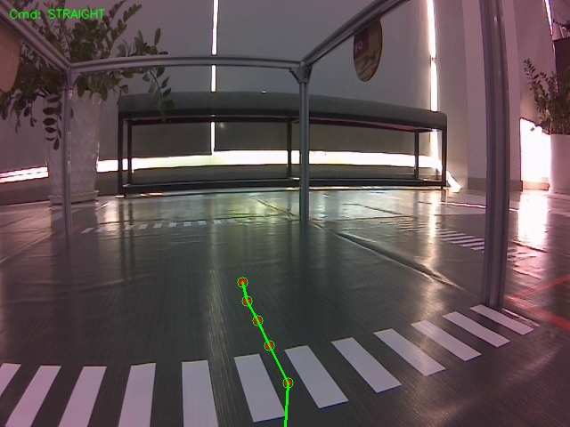 | 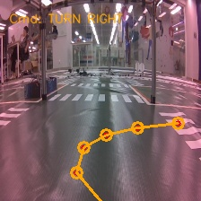 |
| 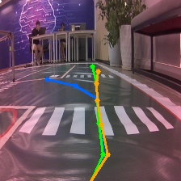 | 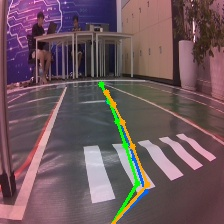 | 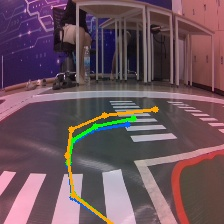 |

---

### 🚦 3. Real-Time Object & Traffic Light Detection (YOLO)
YOLO detector (`best.onnx`) predicting traffic signals (**Green Light**, **Red Light**) and traffic signs (**Prohibition**, **Turn Left/Right**, **Straight Ahead**).

| | | | |
| :-: | :-: | :-: | :-: |
| 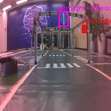 | 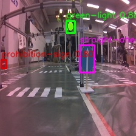 | 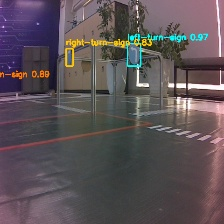 | 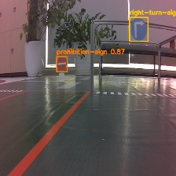 |

---

### 🛑 4. Real-time Collision Avoidance
Binary MobileNet classifier monitoring path status to trigger emergency stop and reverse safety maneuvers.

| Path Blocked (Obstacle Detected) | Path Free (Clear Track) |
| :-: | :-: |
| 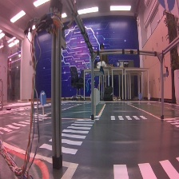 | 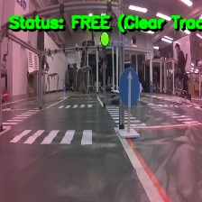 |

---

## 🔄 System Processing Workflows

### 🛣️ Workflow 1: Lane Following Pipeline

```
┌─────────────────────────────────────────────────────────┐
│                 📷 CSI Camera Input                     │
└────────────────────────────┬────────────────────────────┘
                             │
                             ▼
┌─────────────────────────────────────────────────────────┐
│               🧠 ResNet-18 Regression                   │
└────────────────────────────┬────────────────────────────┘
                             │ (Target Point)
                             ▼
┌─────────────────────────────────────────────────────────┐
│                🎛️ Stanley Controller                    │
└────────────────────────────┬────────────────────────────┘
                             │ (Steering & Throttle)
                             ▼
┌─────────────────────────────────────────────────────────┐
│               🚗 Racecar HAL Execution                  │
└─────────────────────────────────────────────────────────┘
```

---

### 🅰️ Workflow 2: Smart City Option A Pipeline (`smart_city.ipynb`)

```
                  ┌───────────────────────┐
                  │   📷 CSI Camera Input │
                  └───────────┬───────────┘
                              │
               ┌──────────────┴──────────────┐
               ▼                             ▼
   ┌──────────────────────┐      ┌──────────────────────┐
   │ 🔍 YOLO Sign Detector│      │🛑 MobileNet Classifier│
   └───────────┬──────────┘      └───────────┬──────────┘
               │                             │
               │ (Sign Detections)           ├───────────────┐ (Path Blocked)
               │                             ▼               │
               │                 ┌──────────────────────┐    │
               │                 │ 🔄 Reverse Turning   │    │
               │                 └───────────┬──────────┘    │
               │                             │               │
               │                             ▼               │
               │                 ┌──────────────────────┐    │
               │                 │       ⏸️ Pause        │    │
               │                 └───────────┬──────────┘    │
               │                             │               │
               │                             ▼               │
               │                 ┌──────────────────────┐    │
               │                 │   🔍 Check Forward   │    │
               │                 └───────────┬──────────┘    │
               │                             │ (Path Clear)  │
               ▼                             ▼               │
   ┌────────────────────────────────────────────────────┐    │
   │               🚦 Traffic FSM Engine                 │    │
   └───────────┬────────────────────────────────────────┘    │
               │                                             │
               ▼                                             ▼
   ┌────────────────────────────────────────────────────────────┐
   │              🚗 Racecar Controller Execution               │
   └────────────────────────────────────────────────────────────┘
```

---

### 🅱️ Workflow 3: Smart City Option B Pipeline (`smart_city_multitask.ipynb`)

```
                              ┌───────────────────────┐
                              │   📷 CSI Camera Input │
                              └───────────┬───────────┘
                                          │
         ┌────────────────────────────────┼────────────────────────────────┐
         ▼                                ▼                                ▼
┌──────────────────┐            ┌──────────────────┐            ┌──────────────────────┐
│ 🔍 YOLO Sign/Light│            │🛑 MobileNet Safety│            │📍 Trajectory Model   │
└────────┬─────────┘            └────────┬─────────┘            └──────────┬───────────┘
         │                               │                                 │
         ▼                               │                                 ▼
┌──────────────────┐                     │ (Path Blocked)       ┌──────────────────────┐
│🚦 Traffic Rules  ├─────────────────────┼─────────────────────►│ 🎛️ Pure Pursuit Ctrl │
└──────────────────┘                     │                      └──────────┬───────────┘
                                         ▼                                 │
                            ┌──────────────────────────┐                   │ (Path Free)
                            │ 🔄 Escape State Machine  │                   │
                            │ (Reverse/Pause/Check)    │                   │
                            └────────────┬─────────────┘                   │
                                         │                                 │
                                         ▼                                 ▼
                            ┌──────────────────────────────────────────────────────────┐
                            │              🚗 Racecar Hardware Execution               │
                            └──────────────────────────────────────────────────────────┘
```

---

## 🛠️ Complete Installation & Vehicle Setup Guide

### Step 1: Install System Environment & ROS Melodic
Run the automated environment setup script:

```bash
bash scripts/setup_env.sh
```

<details>
<summary><b>Click to view manual ROS & CUDA setup commands</b></summary>

```bash
# 1. Add ROS Melodic Repository & Keys
sudo sh -c 'echo "deb http://packages.ros.org/ros/ubuntu $(lsb_release -sc) main" > /etc/apt/sources.list.d/ros-latest.list'
sudo apt-key adv --keyserver 'hkp://keyserver.ubuntu.com:80' --recv-key C1CF6E31E6BADE8868B172B4F42ED6FBAB17C654

# 2. Install ROS Core Packages & Dependencies
sudo apt update
sudo apt install -y ros-melodic-ros-base ros-melodic-catkin python-catkin-tools
sudo apt install -y ros-melodic-tf ros-melodic-tf2 ros-melodic-tf2-ros ros-melodic-gscam ros-melodic-web-video-server
sudo apt install -y python3-pip python3-dev python3-catkin-pkg python3-rospkg python3-empy python3-yaml python3-pycuda jupyterlab

pip3 install numpy catkin_pkg rospkg empy opencv-python requests

# 3. Configure CUDA & Python 3 rospy Environment in ~/.bashrc
echo "source /opt/ros/melodic/setup.bash" >> ~/.bashrc
echo 'export PATH=/usr/local/cuda/bin:$PATH' >> ~/.bashrc
echo 'export LD_LIBRARY_PATH=/usr/local/cuda/lib64:$LD_LIBRARY_PATH' >> ~/.bashrc
echo 'export PYTHONPATH=$PYTHONPATH:/opt/ros/melodic/lib/python2.7/dist-packages' >> ~/.bashrc

source ~/.bashrc

# 4. Verify Python 3 rospy Import
python3 -c "import rospy; print('Python 3 rospy: OK')"
```
</details>

---

### Step 2: Build Vehicle Catkin Workspace
Initialize your Catkin workspace and build vehicle packages using Python 3:

```bash
bash scripts/setup_car.sh
```

---

### Step 3: Launch Camera Stream & Web Video Server

#### 📷 Launch CSI Camera Node
```bash
bash scripts/launch_camera.sh
```
*(If camera hardware is unresponsive, restart daemon: `sudo systemctl restart nvargus-daemon`)*

#### 🌐 View Camera Stream in Browser
Start `web_video_server` in another terminal:
```bash
bash scripts/launch_web_stream.sh
```
Open browser at: `http://<jetson-ip>:8080/stream_viewer?topic=/csi_cam_0/image_raw`

---

### Step 4: Export TensorRT Engines (`trtexec`)
Accelerate ONNX model inference using TensorRT FP16:

```bash
# Run helper script
bash scripts/export_tensorrt.sh models/urban_traffic/best.onnx models/urban_traffic/best.engine

# Or execute trtexec directly
/usr/src/tensorrt/bin/trtexec --onnx=models/urban_traffic/best.onnx --saveEngine=models/urban_traffic/best.engine --fp16
```

---

### Step 5: Launch JupyterLab
Start JupyterLab for interactive notebook execution:

```bash
jupyter lab --no-browser --ip=0.0.0.0 --port=8888
```

---

## 🏎️ Autonomous Driving Execution Modes

The platform supports two core operational modes:

### 🛣️ Mode 1: Autonomous Lane Following
Road navigation powered by a ResNet-18 steering regression model and the **Stanley Controller**.
- **AI Model**: ResNet-18 Regression predicting target apex coordinates `(x, y)`.
- **Steering Control**: **Stanley Controller** calculates adaptive steering angles and throttle based on apex offset.
- **Notebook**: `notebooks/1_lane_following/04_road_following_live.ipynb`

---

### 🏙️ Mode 2: Smart City Urban Driving Options

The platform offers two modular architecture options for smart city navigation:

#### 🅰️ Option A: FSM & Navigation Pipeline (`notebooks/2_urban_traffic/smart_city.ipynb`)
A deterministic state machine system featuring real-time obstacle evasion and traffic sign reaction.
- **AI Models**: YOLO Sign Detector (`best.onnx`) + MobileNet Road Safety Classifier (`best_model_mobilenet.onnx`).
- **State Machines**:
  - `TrafficFSM`: Filters detections spatially by bounding box area and ROI margins, resolving sign priorities.
  - `NavigationFSM`: Handles 2-phase obstacle evasion (`DRIVE` -> `REVERSE_TURNING` -> `PAUSE` -> `CHECK_FORWARD`), 30s STOP signal timeout, directional reversing, and max reverse cycle limits.
- **Notebook**: `notebooks/2_urban_traffic/smart_city.ipynb`

#### 🅱️ Option B: Multi-Model Multi-Task Pipeline (`notebooks/2_urban_traffic/smart_city_multitask.ipynb`)
A 3-model parallel inference system combining sign detection, road safety, and trajectory prediction.
- **AI Models**: YOLO Detector + MobileNet Road Safety + Conditioned Trajectory Model (5 Waypoints).
- **Steering Control**: `PurePursuitController` continuous waypoint steering when the path is `FREE`; transitions to obstacle escape FSM when `BLOCKED`.
- **Notebook**: `notebooks/2_urban_traffic/smart_city_multitask.ipynb`

---

## 🚦 Training YOLO Traffic Sign & Signal Detector

Use **`notebooks/2_urban_traffic/TrafficSignModel.ipynb`** to train custom YOLOv8 object detection models:

> [!NOTE]
> You can also use third-party platforms such as **[Roboflow](https://roboflow.com/)** or custom labeling tools to annotate datasets and train YOLOv8 models conveniently.

1. **Acquire Dataset**: Downloads annotated JetRacer SmartCity dataset from Kaggle.
2. **Train Model**: Runs Ultralytics YOLOv8 training.
3. **Export ONNX**: Exports trained weights to ONNX format for Jetson Nano TensorRT deployment.

---

## 📓 Notebook Directory Structure

All notebooks are organized under `notebooks/`:

```
notebooks/
├── 1_lane_following/
│   ├── 01_interactive_data_collection.ipynb
│   ├── 02_train_model_onnx.ipynb
│   ├── 03_export_tensorrt.ipynb
│   └── 04_road_following_live.ipynb
└── 2_urban_traffic/
    ├── smart_city.ipynb            # Option A: FSM + Navigation + Road AI (Primary)
    ├── smart_city_multitask.ipynb  # Option B: 3-Model Multi-task Pipeline
    ├── TrafficSignModel.ipynb      # YOLOv8 Training Guide
    ├── car_test.ipynb              # Hardware Diagnostic Test
    ├── data_collection_raw.ipynb
    ├── train_conditioned_lane_model.ipynb
    └── export_tensorrt_engine.ipynb
```

---

## 📂 Project Architecture

```
JetRacer_AI/
├── jetracer_ai/        # Core package (core, hardware, lane_following, urban_traffic, utils)
├── notebooks/          # Phase 1 (Lane Following) & Phase 2 (Urban Traffic)
├── models/             # Pretrained ONNX weights & TensorRT engines
├── datasets/           # Captured driving datasets
├── apps/               # Standalone execution scripts
├── tools/              # Annotation GUI tools
├── scripts/            # Environment & camera setup bash scripts
└── config/             # System settings & parameters
```

---

## 📊 Datasets & Pretrained Models

- 📦 **Hugging Face**: [`truongpmn/Jetracer_ai`](https://huggingface.co/datasets/truongpmn/Jetracer_ai) (Lane steering vectors & urban classification images)
- 💙 **Kaggle**: [`daf2pro/jetracer-smartcity`](https://www.kaggle.com/datasets/daf2pro/jetracer-smartcity) (YOLOv8 traffic sign dataset)

---

## 👥 Collaborators & Co-Authors

- **CallmeTruong**: [github.com/CallmeTruong](https://github.com/CallmeTruong)
- **mducdaf2**: [github.com/mducdaf2](https://github.com/mducdaf2)

---

## ❓ Troubleshooting

- **Camera Feed Black / Frozen**: Run `sudo systemctl restart nvargus-daemon` or `bash scripts/launch_camera.sh --restart-daemon`.
- **`rospy` Import Error**: Ensure `PYTHONPATH` includes ROS Melodic packages in `~/.bashrc`.
- **Low Inference FPS**: Convert ONNX models to TensorRT engines using `bash scripts/export_tensorrt.sh`.
